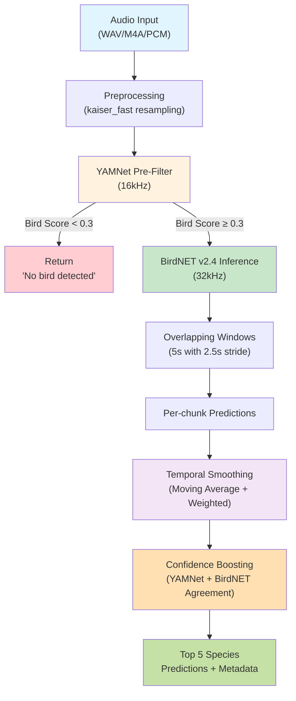

# SoundScape - Comprehensive Project Documentation

## Table of Contents
1. [Introduction](#1-introduction)
2. [Project Details](#2-project-details)
3. [Existing System](#3-existing-system)
4. [Proposed System](#4-proposed-system)
5. [System Architecture](#5-system-architecture)
6. [Programming Language & Frameworks](#6-programming-language--frameworks)
7. [Hardware Specifications](#7-hardware-specifications)
8. [Software Specifications](#8-software-specifications)
9. [Module Description](#9-module-description)
10. [Data Flow Diagrams (DFD)](#10-data-flow-diagrams-dfd)
11. [Database Design](#11-database-design)
12. [Machine Learning Models](#12-machine-learning-models)
13. [Future Enhancements](#13-future-enhancements)
14. [Bibliography](#14-bibliography)
15. [Version History & Changelogs](#15-version-history--changelogs)
- [Appendix A: Installation Guide](#appendix-a-installation-guide)
- [Appendix B: API Documentation](#appendix-b-api-documentation)
- [Appendix C: Troubleshooting Guide](#appendix-c-troubleshooting-guide)
- [Appendix D: Glossary](#appendix-d-glossary)

---

## 1. Introduction

### 1.1 Overview
**SoundScape** is an innovative mobile application designed for ecological bioacoustics research and bird watching enthusiasts. The application leverages modern mobile computing capabilities, machine learning, and cloud infrastructure to enable real-time bird sound recording, analysis, and species identification. Built on the Flutter framework, SoundScape provides a cross-platform solution for iOS, Android, Linux, macOS, and Windows devices.

### 1.2 Purpose
The primary purpose of SoundScape is to:
- Enable citizen scientists to contribute to biodiversity monitoring
- Provide accurate bird species identification using machine learning
- Create a geospatial database of bird vocalizations
- Support ecological research through crowdsourced acoustic data
- Provide real-time analysis and community-driven data collection

### 1.3 Scope
SoundScape encompasses:
- Audio recording and processing
- Real-time noise level monitoring
- On-device machine learning inference
- Cloud synchronization and storage
- Geographic mapping of recordings
- Community-driven data collection
- Social sharing and collaboration features

### 1.4 Problem Statement
Traditional bird watching and biodiversity monitoring face several challenges:
- Manual identification requires expert knowledge
- Limited spatial and temporal coverage
- Difficulty in tracking migratory patterns
- Lack of standardized data collection methods
- No centralized platform for citizen science contributions

SoundScape addresses these challenges by providing an accessible, automated, and scientifically rigorous tool for acoustic biodiversity monitoring.

---

## 2. Project Details

### 2.1 Project Information
- **Project Name**: SoundScape
- **Version**: 2.5.0+2
- **Platform**: Cross-platform (iOS, Android, Linux, macOS, Windows, Web)
- **Framework**: Flutter 3.9.0
- **Backend**: Appwrite (Backend-as-a-Service)
- **AI API**: FastAPI v6.1.0 with BirdNET v2.4 + YAMNet
- **Development Language**: Dart
- **Architecture Pattern**: GetX (MVC with reactive programming)

### 2.2 Key Features
1. **Audio Recording**: High-quality audio capture with real-time waveform visualization
2. **Multi-Species Identification**: Simultaneous detection of up to 5 species using BirdNET v2.4 and YAMNet
3. **Professional Waveform Synchronization**: Master-clocked visualization with progress highlighting and interactive seeking
4. **Reliable Notification System**: Global context-independent notification architecture for stable user feedback
5. **Undo Functionality**: Safety mechanism for accidental recording deletions in the Library
6. **Smart Search**: Search by species name or unique recording ID across Map and Library modules
7. **Admin Access**: Dedicated administrative privileges for community data management
8. **Noise Monitoring**: Real-time decibel level measurement
9. **Geolocation Tracking**: GPS-tagged recordings with interactive map visualization
10. **Cloud Synchronization**: Automatic backup and centralized sync across devices (5000+ records)
11. **Offline Capability**: Full functionality without internet connection
12. **Multilingual Support**: Wikipedia integration for English, Malayalam, and Hindi

### 2.3 Target Users
- Bird watching enthusiasts
- Ecological researchers and scientists
- Environmental conservation organizations
- Educational institutions
- Citizen scientists
- Wildlife sanctuary managers

---

## 3. Existing System

### 3.1 Current Approaches

#### 3.1.1 Manual Bird Identification
Traditional bird watching relies on:
- **Visual Identification**: Requires expert knowledge of bird morphology
- **Audio Identification**: Depends on memorization of bird calls
- **Field Guides**: Physical or digital books with species information
- **Limitations**: 
  - Requires extensive training
  - Subject to human error
  - Time-consuming
  - Limited documentation

#### 3.1.2 Existing Applications

**eBird by Cornell Lab of Ornithology**
- Strengths: Large community, comprehensive database
- Limitations: Manual species identification, limited audio features

**Merlin Bird ID**
- Strengths: Photo and sound identification
- Limitations: No recording storage, limited analysis features

**Song Sleuth**
- Strengths: Automated recording suggestions
- Limitations: Limited species coverage, requires manual confirmation

**Warblr**
- Strengths: Bird sound detection
- Limitations: Discontinued, limited species coverage

### 3.2 Limitations of Existing Systems
1. **Fragmented Ecosystem**: Different tools for recording, identification, and data management
2. **Limited ML Integration**: Most apps lack on-device machine learning
3. **Poor Offline Support**: Require constant internet connectivity
4. **Privacy Concerns**: Cloud-only processing of sensitive location data
5. **Limited Analysis Tools**: Lack of noise monitoring and acoustic analysis features
6. **Poor Community Features**: Limited collaboration and data sharing capabilities
7. **No Real-time Processing**: Delayed species identification
8. **Proprietary Platforms**: Closed-source, vendor lock-in
9. **High Cost**: Many professional tools require expensive subscriptions
10. **Limited Species Coverage**: Regional limitations, not globally comprehensive
11. **Poor Data Export**: Limited ability to export data for research
12. **Mobile-Only or Desktop-Only**: Not truly cross-platform
13. **Battery Drain**: Inefficient algorithms consume excessive power

---

## 4. Proposed System

### 4.1 System Overview
SoundScape integrates multiple technologies into a unified platform:
- **Mobile Application**: Flutter-based cross-platform frontend
- **Edge Computing**: On-device ML inference using TensorFlow Lite
- **Cloud Backend**: Appwrite for authentication, storage, and sync
- **Geospatial Database**: Location-tagged recordings with map visualization
- **Community Platform**: Social features for collaboration and verification

### 4.2 Key Innovations

#### 4.2.1 Hybrid ML Architecture
- **On-device Processing**: Privacy-preserving, works offline
- **Cloud Enhancement**: Optional server-side processing for advanced analysis
- **Model Zoo**: YAMNet (speech detection) + BirdNET (species identification)

#### 4.2.2 Multi-sensor Fusion
- **Audio**: Primary identification signal
- **GPS**: Spatial context for species distribution
- **Accelerometer/Compass**: Device orientation for directional recording
- **Environmental Data**: Temperature and weather conditions for context

#### 4.2.3 Community Collaboration
- Real-time sync of discoveries across users
- Community verification of species identifications
- Shared observations and insights
- Push notifications for rare species alerts in your area

### 4.3 Advantages Over Existing Systems
1. **All-in-One Solution**: Recording, analysis, storage, and visualization
2. **Privacy-First**: On-device ML inference, optional cloud sync
3. **Offline-Capable**: Full functionality without internet
4. **Community-Driven**: Social features and collaborative verification
5. **Open Architecture**: Modular design for community contributions
6. **Scientific Rigor**: Confidence scores, validation mechanisms, data export

---

## 5. System Architecture

### 5.1 High-Level Architecture

```mermaid
graph TB
    subgraph PL["PRESENTATION LAYER"]
        Home["Home<br/>Screen"]
        Library["Library<br/>Screen"]
        Map["Map<br/>Screen"]
        Settings["Settings<br/>Screen"]
    end
    
    subgraph CL["CONTROLLER LAYER (GetX)"]
        HomeCtrl["HomeController"]
        LibCtrl["LibraryController"]
        MapCtrl["MapController"]
    end
    
    subgraph SL["SERVICE LAYER"]
        Appwrite["Appwrite<br/>Service"]
        Audio["AudioAnalysis<br/>Service"]
        Location["Location<br/>Service"]
        Storage["Storage<br/>Service"]
        Noise["Noise<br/>Service"]
        Sync["Sync<br/>Service"]
        Evo["EvolutionAPI<br/>Service"]
    end
    
    subgraph DL["DATA LAYER"]
        Hive["Hive<br/>(Local DB)"]
        AppwriteDB["Appwrite<br/>(Cloud DB)"]
        TFLite["TFLite<br/>(ML Models)"]
    end
    
    subgraph HL["HARDWARE LAYER"]
        Mic["Microphone"]
        GPS["GPS Sensor"]
        Accel["Accelerometer"]
    end
    
    PL <--> CL
    CL <--> SL
    SL <--> DL
    DL <--> HL
    
    style PL fill:#e1f5ff
    style CL fill:#fff3e0
    style SL fill:#f3e5f5
    style DL fill:#e8f5e9
    style HL fill:#fce4ec
```

### 5.2 Component Architecture

#### 5.2.1 Frontend (Flutter)
- **Framework**: Flutter 3.9.0 with Dart SDK
- **State Management**: GetX (Reactive programming)
- **UI Components**: Material Design widgets
- **Routing**: GetX navigation system
- **Global Key Support**: `GlobalKey<ScaffoldMessengerState>` for reliable notifications

#### 5.2.2 Backend (Appwrite)
- **Authentication**: User management with JWT tokens and password recovery
- **Database**: Document-based storage with increased 5000-document fetch limit
- **Storage**: File storage for audio files and images
- **Functions**: Serverless functions for processing
- **Real-time**: WebSocket for live updates

#### 5.2.3 Machine Learning Pipeline (v5.0.0)

---

## 9. Module Description

### 9.1 Authentication Module (v2.5.0)

#### 9.1.1 Purpose
Handle secure user access, registration, and recovery with detailed feedback.

#### 9.1.2 Components
- **AuthController**: Manages login, signup, and forgot password flows
- **AppwriteService**: Backend authentication integration
- **LoginView / SignupView**: High-contrast, accessible UI

#### 9.1.3 Features
- **Reliable Error Feedback**: Catch-all Appwrite exception handling with user-friendly messages
- **Password Recovery**: Integrated "Forgot Password" flow via Appwrite recovery emails
- **High-Contrast Input**: Improved text field visibility with focused border states
- **Session Persistence**: Robust logout logic with confirmation safety

---

### 9.2 Home (Recording) Module (v2.5.0)

#### 9.2.1 Purpose
Core audio recording and real-time visualization.

#### 9.2.2 Components
- **HomeController**: Orchestrates capture, analysis, and visualization
- **LiveWaveformPainter**: Custom real-time amplitude visualization
- **Permission Guard**: microphone permission requested *before* tips dialog

#### 9.2.3 Features
- **Real-time Graphical Waveform**: Instantly reacting teal waveform during capture
- **Interactive Review Spectrogram**: Post-recording waveform with seeking and progress highlighting
- **Synchronized Playback**: Lockstep audio and visual progress
- **Speech Rejection**: Automatic discarding of clips containing high-confidence human speech

---

### 9.3 Library Module (v2.5.0)

#### 9.3.1 Purpose
Manage and explore the personalized sound library.

#### 9.3.2 Components
- **LibraryController**: Snappy local filtering and centralized sync
- **Undo Deletion System**: 4-second safety window for accidental swipes

#### 9.3.3 Features
- **Smart ID Search**: Support for full recording ID lookups
- **English-Only Names**: Automatic sanitization of species results (removes non-English names)
- **Centralized Synchronization**: One-tap remote sync with Appwrite
- **Admin Management**: Global deletion rights for the admin account (`androlite4@gmail.com`)

---

### 9.4 Details Module (v2.5.0)

#### 9.4.1 Purpose
Deep dive into individual recording data and AI findings.

#### 9.4.2 Features
- **Master-Synchronized Waveform**: 50ms refresh rate for perfect audio-visual alignment
- **Deep Scan Optimization**: Top 3 findings display for cleaner analysis
- **System Map Integration**: One-tap transition to system's default map app (Google/Apple Maps)
- **Normalized Confidence**: Consistent 0-100% display logic across all cards

---

### 9.5 Map Module (v2.5.0)

#### 9.5.1 Purpose
Geographic exploration of soundscapes.

#### 9.5.2 Features
- **Navigation Controls**: Integrated Zoom In/Out and Center on User buttons
- **North Button**: Real-time rotating compass button to reset map orientation
- **Zoom Constraints**: Restricted range (3.0 - 18.0) for optimal tile performance
- **Global ID Lookup**: Paste a recording ID to find its exact marker instantly

---

## 15. Version History & Changelogs

### 15.1 Version 2.5.0 - "Core Reliability"
**Release Date**: February 5, 2026  
**Build**: Release APK 2.5.0+2

#### Major Improvements:
- **Notification Overhaul**: Fixed "No Overlay" crashes by implementing a `GlobalKey<ScaffoldMessengerState>` system.
- **Waveform Master-Sync**: Completely rewrote the visualization engine to use the audio player as the master clock, eliminating visual drift.
- **ID-Based Searching**: Added full support for pasted recording IDs in both Library and Map search bars.
- **Microphone Permission Flow**: Reordered the recording start logic to request system permissions *before* showing app tips.
- **Undo Logic**: Added a native SnackBar-based "UNDO" feature for recording deletions.
- **Name Sanitization**: Automated removal of non-English/Cyrillic names from identification results.
- **Admin Controls**: Provisioned admin privileges for `androlite4@gmail.com`.
- **Map Polish**: Added rotation reset (North button) and strict zoom limits.
- **Deep Scan Tweak**: Limited scan findings to the top 3 items for better UX.
- **Model Cleanup**: Removed deprecated/broken model download links.

### 15.2 Version 2.1.0 - "Web Explorer"
**Release Date**: February 3, 2026  
- **Web Map Interface**: Interactive Map & Details panel for desktop browsers.
- **Platform-Aware Routing**: Automatic switching between HomeView and HomeWebView.

### 15.3 Version 2.0.0 - "Multi-Species"
**Release Date**: February 3, 2026  
- **Simultaneous Detection**: Identify up to 5 species in one recording.
- **ML Pipeline v5.0**: Combined YAMNet + BirdNET v2.4 with temporal smoothing.
- **Visual Rankings**: Medal-based species cards (🏆🥈🥉).

---

**Document Version**: 2.5  
**Application Version**: 2.5.0+2  
**API Version**: 6.1.0  
**Last Updated**: February 5, 2026  
**Prepared By**: SoundScape Development Team  
**Contact**: muhammedshabeerop@gmail.com  
**Repository**: https://github.com/muhammedshabeerop/SoundScape